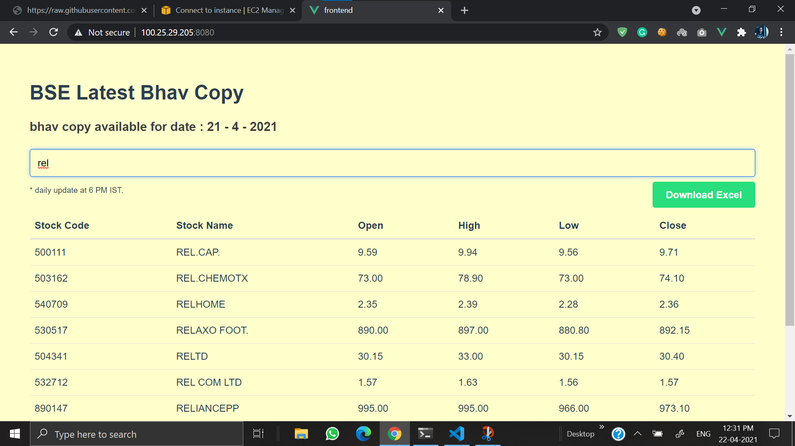

# BSE Bhav Copy

## Requirements

- Downloads the equity bhavcopy zip from the https://www.bseindia.com/markets/MarketInfo/BhavCopy.aspx every day at 18:00 IST for the current date.
- Extracts and parses the CSV file in it.
- Writes the records into Redis with appropriate data structures (Fields: code, name, open, high, low, close).
- Renders a simple VueJS frontend with a search box that allows the stored entries to be searched by name and renders a table of results and optionally downloads the results as CSV. Make this page look nice!
- The search needs to be performed on the backend using Redis.

## Setup Instruction

1. Clone this repository.
2. Create virtual Environment for django backend.
3. Activate into virtual environment and run `pip install -r requirements.txt`.
4. To setup cronjob execute `cron.sh`.
5. To run backend execute `python manage.py runserver`
6. To run frontend execute `npm run serve`
7. Make sure that redis is running by `systemctl status redis` and if not than start it.

## Screenshot

